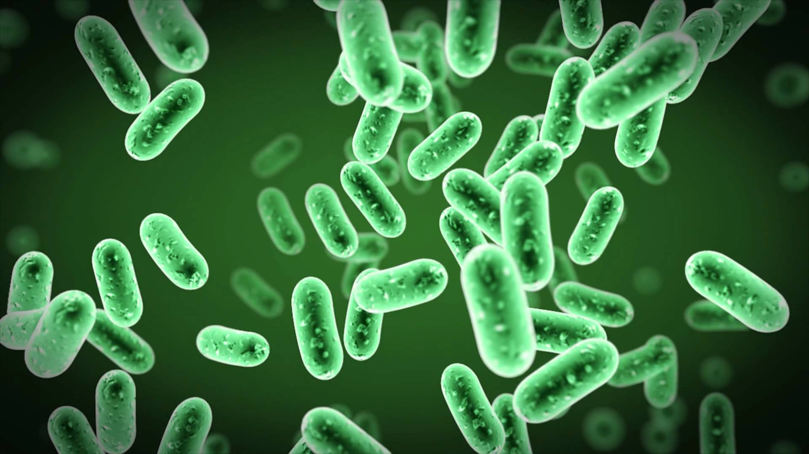

# Belly-Button-Biodiversity

## Overview of Analysis:
The purpose of the Belly Button Diversity project is to build an HTML page that allows you to visualize data retrieved from testing samples of belly button bacteria in a number of people. The data is filtered using javascript from a JSON file to allow the user to select the test subject by their ID and have a complete breakdown of their demographics, top 10 bacteria cultures, a gauge on their washing frequency and a bubble charge showing the operational taxonomic units of the microbial species found. Coding was completed using Visual Studio. 

### Results
#### Drop down and Demographic Information

A simple to use drop down feature alloss you to select a test subject by their associated ID.

#### Bar Graph

The Bar Chart represents the top 10 bacteria cultures present in the sample ranging from least to greatest. Hovering over each horizontal bar displays the bacteria species.

#### Gauge Graph

The Gauge Chart represents the weekly washing freqency of each participants belly button.

#### Bubble Graph

The Bubble Chart represents the amount of each bacterial species based on the sample cultures on the sample ID chosen above. The bubbles grow with the quanity and frequency of each bateria culture.

## Summary
This page is designed to allow the test results to view their results of the sample taken from their belly buttons. What this page provides is a bar graph, a gauge chart and a bubble chart as visual representations of the data collected. The dataset reveals that a small handful of microbial species (also called operational taxonomic units, or OTUs, in the study) were present in more than 70% of people, while the rest were relatively rare.
